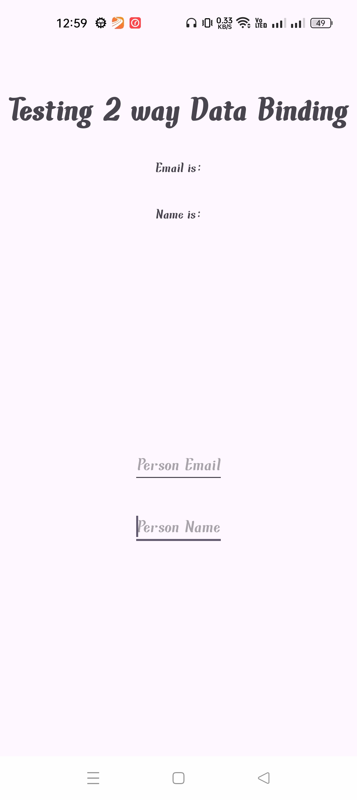
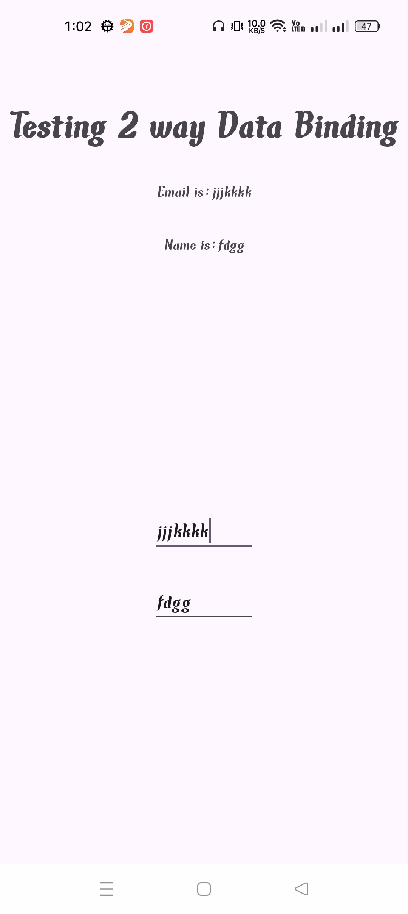
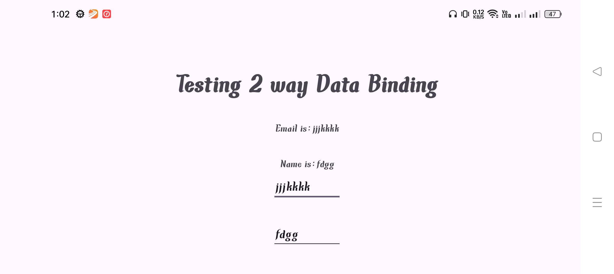

# ✨ Two-Way Data Binding with ViewModel in Android

This project demonstrates a core concept in modern Android development: **two-way data binding** combined with `ViewModel` to create a **responsive** and **lifecycle-aware** UI.

It shows how data and UI elements (like `EditText`) stay synchronized automatically, and how `ViewModel` helps preserve that data during configuration changes such as screen rotations — creating a **smooth and consistent user experience**.

---

## 🚀 Features

- 🔄 **Two-Way Data Binding**: Keep your UI and data synced effortlessly
- 📱 **Reactive UI**: UI reflects data changes instantly
- 🔒 **Safe Configuration Handling**: Data stays intact even after screen rotation
- ✅ **Clean Architecture**: Based on the MVVM (Model-View-ViewModel) pattern

---

## 🧠 How It Works

✨ **Two-way data binding** ensures that:
- When the user types into an input field, the data source is updated.
- When the data source is updated, the input field reflects the change.

🛡 **ViewModel** keeps your data safe from being wiped during:
- 🔁 Screen rotations
- ⛔ Activity recreation

The result: a **reactive**, **resilient**, and **maintainable** UI.

---

## 📷 Screenshots

### 🧼 Initial State | 👨‍💻 User Input | 🔁 After Rotation

  
  
  

---

## 🧩 Architecture Used

- 🧠 `ViewModel`: Keeps data across lifecycle changes
- 🔄 `LiveData`: Enables data-observing UI
- 🧼 `ViewBinding`: Removes the need for `findViewById`
- 💡 `MVVM Pattern`: Clean separation between UI and logic

---

## 🔁 Reusability

This example is designed to be easily integrated into any Android project. You can:
- Drop in the `ViewModel` and layout structure
- Reuse the binding and lifecycle logic
- Replace the data model to fit your needs

---

## 🤝 Contributing

If you find improvements or ideas worth sharing, feel free to fork this project and submit a pull request!

---

---

⭐ If you liked this project, don’t forget to **star** the repo and follow me on GitHub!
